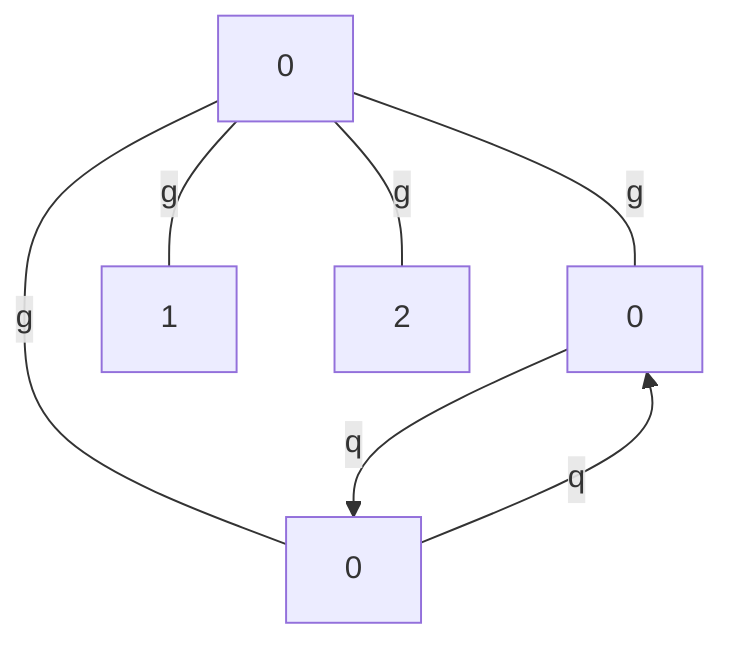
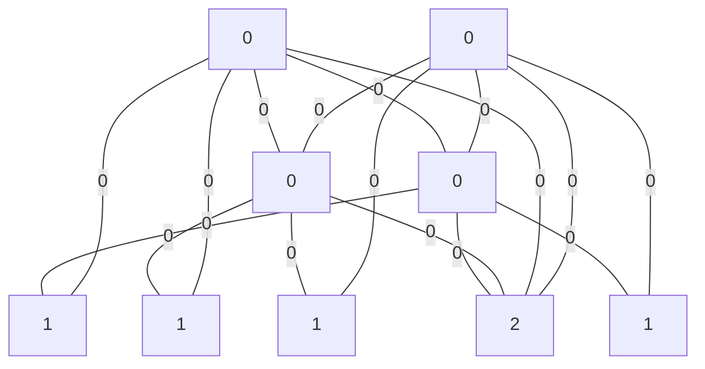

# Graphica

<p align="center">
<a href="https://symbolica.io"></a>
  <a href="https://zulip.symbolica.io"></a>
    <a href="https://github.com/symbolica-dev/graphica"></a>
    <a href="https://app.codecov.io/gh/symbolica-dev/graphica"></a>
</p>

Graphica is an open-source graph crate for Rust that allows for the generation, manipulation and canonization of multi-edge graphs with mixed directed and undirected edges and arbitrary node and edge data.

Graphica was open sourced by Ruijl Research and is a part of [Symbolica](https://symbolica.io).

# Examples

### Graph generation

Generate all unique graphs with two external edges with edge data `g` and with vertices with specific edge attachments:

```rust
let g = HalfEdge::undirected("g");
let q = HalfEdge::incoming("q");
let gs = Graph::<_, &str>::generate(
    &[(1, g), (2, g)],
    &[vec![g, g, g], vec![q.flip(), q, g], vec![g, g, g, g]],
    GenerationSettings::new()
        .max_loops(2)
        .max_bridges(0)
        .allow_self_loops(true),
)
.unwrap();

let r = gs.keys().next().unwrap().to_mermaid();
println!("{}", r);
```
yields



### Graph canonization

Use a modified version of McKay's graph canonization algorithm to canonize graphs and detect isomorphisms:

```rust
let mut g = Graph::new();
let n0 = g.add_node(1);
let n1 = g.add_node(0);
let n2 = g.add_node(1);
let n3 = g.add_node(0);
let n4 = g.add_node(2);
let n5 = g.add_node(0);
let n6 = g.add_node(1);
let n7 = g.add_node(0);
let n8 = g.add_node(1);

g.add_edge(n0, n1, false, 0).unwrap();
g.add_edge(n0, n3, false, 0).unwrap();
g.add_edge(n1, n2, false, 0).unwrap();
g.add_edge(n1, n3, false, 0).unwrap();
g.add_edge(n1, n4, false, 0).unwrap();
g.add_edge(n1, n5, false, 0).unwrap();
g.add_edge(n2, n5, false, 0).unwrap();
g.add_edge(n3, n4, false, 0).unwrap();
g.add_edge(n3, n6, false, 0).unwrap();
g.add_edge(n3, n7, false, 0).unwrap();
g.add_edge(n4, n5, false, 0).unwrap();
g.add_edge(n4, n7, false, 0).unwrap();
g.add_edge(n5, n7, false, 0).unwrap();
g.add_edge(n5, n8, false, 0).unwrap();
g.add_edge(n6, n7, false, 0).unwrap();
g.add_edge(n7, n8, false, 0).unwrap();

let c = g.canonize();

assert_eq!(c.orbit_generators.len(), 2);
assert_eq!(c.automorphism_group_size, 8);

println!("{}", c.graph.to_dot());
```
yields canonical graph


## Development

Follow the development and discussions on [Zulip](https://reform.zulipchat.com)!